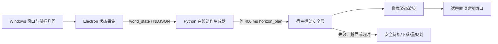

# PET：实时生成动作的 Windows 像素桌宠

PET 是一个只面向 Windows 11 的本地开发原型。运行时不会直接播放预录动作片段：Electron 宿主持续采集鼠标与可见窗口的几何状态，Python 生成器在线生成约 400 ms 的短时根轨迹与骨骼姿态，宿主再经过碰撞、速度和屏幕边界安全层后渲染归一化为 48×48 的角色。

当前里程碑的自动化链路已经打通，使用轻量随机自回归规划器验证交互和运行时架构；它是后续条件扩散/自回归神经网络的可运行基线，不代表最终训练模型。人工桌面交互、连续 30 分钟稳定性和端到端延迟验收仍待完成，验收状态以 [`docs/milestone-1-acceptance.md`](docs/milestone-1-acceptance.md) 中的勾选结果为准。

## 已实现

- 透明、无边框、置顶的 96×96 Electron 桌宠窗口，内部以 48×48 最近邻放大渲染；
- 把附近可见窗口顶部的水平边缘识别为可行走表面；
- 在线生成行走、跳跃、下落和点击反应，不播放动作精灵表；
- 角色 manifest 驱动的任意骨骼拓扑、3D local quaternion FK 与正交侧视投影；
- 离线桌面场景模拟、角色动画 teacher、版本化训练数据 ABI；
- 可选轨迹记录、确定性执行回放与离线指标报告；
- 猫的不透明像素拦截左键，透明像素把点击传给下方窗口；
- 全屏应用、开始菜单及系统/安全界面出现时隐藏；
- Python 子进程握手、心跳、超时、重启和宿主安全待机；
- Windows 物理像素协议、多显示器/DPI 边界、安全限速与窗口移动重规划；
- 托盘暂停/继续、调试层开关、重启生成器和退出；
- 无网络端口、无遥测，不采集屏幕内容和键盘输入。

## 快速启动

前置条件：Windows 11、Node.js 20+、pnpm 11，以及已配置的 `pet-core` Conda 环境。当前固定 Python 为 3.10.20，PyTorch 为 2.10.0+cu130；详见 [`environment/README.md`](environment/README.md)。

如果普通 PowerShell 尚不能识别 `pnpm`，可用 Node 自带的 Corepack 将项目锁定版本安装到已在用户 `PATH` 中的 npm 目录：

```powershell
corepack install -g pnpm@11.9.0
corepack enable pnpm --install-directory "$env:APPDATA\npm"
pnpm --version
```

```powershell
conda activate pet-core
python environment/smoke_test.py
pnpm install
pnpm dev
```

`pnpm dev` 会先构建共享协议，再启动 Electron；Electron 会自动运行：

```powershell
D:\Anaconda\envs\pet-core\python.exe services/generator/run.py
```

开发时可设置：

```powershell
$env:PET_DEBUG_OVERLAY = "1"       # 启动时显示表面、轨迹与安全状态
$env:PET_DISABLE_GENERATOR = "1"   # 只运行宿主的安全待机路径
$env:PET_PYTHON = "...\python.exe" # 覆盖 Python 路径
$env:PET_CHARACTER_MANIFEST = "...\character.manifest.json" # 选择具体角色
pnpm dev
```

退出请使用系统托盘中的“退出”；关闭可见窗口不会结束托盘宿主。

## 验证

```powershell
pnpm check
pnpm build
```

`pnpm check` 包含 TypeScript 类型检查、桌面安全层测试、Python 生成器测试、跨语言协议 Schema 测试、真实 stdio 子进程集成测试和资产确定性测试。Python/CUDA/研究仓库依赖另由下面的命令验证：

```powershell
conda activate pet-core
python environment/smoke_test.py
```

人工验收项目在 [`docs/milestone-1-acceptance.md`](docs/milestone-1-acceptance.md)，本次自动化与真实进程故障注入证据见 [`docs/verification-2026-07-20.md`](docs/verification-2026-07-20.md)。

## 运行链路



宿主始终是位置的唯一写入者。模型只提出脚底锚点的相对轨迹、低维外观参数，以及与当前 manifest 精确对齐的 `root_translation / root_rotation / local_rotation_deltas`，不能直接移动真实窗口、绕过全屏隐藏策略或读取窗口内容。

## 目录

| 路径 | 作用 |
|---|---|
| `desktop/` | 基于 OpenPets 设计缩减的 Electron/Windows 宿主 |
| `services/generator/` | Python 在线随机自回归轨迹生成器及 PyTorch 后端接口 |
| `packages/protocol/` | JSON Schema、TypeScript/Python 类型和固定协议样本 |
| `assets/pet/` | 角色 manifest、源模型/动画、48×48 运行资产和提取产物 |
| `environment/` | 单一 `pet-core` 环境约束、锁定快照和离线冒烟测试 |
| `tests/` | 跨语言协议及真实生成器 stdio 集成测试 |
| `third_party/` | 保持不改的宿主、动作生成和像素生成参考仓库 |

桌面宿主主要复用 OpenPets 的透明窗口、命中测试、窗口跟踪、单写入运动循环和托盘生命周期设计；具体来源边界见 [`desktop/UPSTREAM.md`](desktop/UPSTREAM.md)。`third_party` 中的研究项目是后续模型实验的参考快照，不应把它们各自冲突的依赖整体安装进统一环境。

## 当前生成器与下一阶段

当前在线 `AutoregressiveMotionBackend` 会根据最新表面、脚底位置、速度和点击边沿事件，以可复现随机种子连续生成短轨迹。它已经具备真实模型所需的服务接口、滚动重规划、点击优先级和故障降级；当前在线骨骼姿态仍是程序化基线，神经 checkpoint 的训练器与推理加载器尚未实现。

离线数据生成器已经用程序化窗口场景和合法根轨迹，叠加当前角色 manifest 声明的 authored animation teacher，产出非 identity 的 rest-local quaternion 监督。下一阶段是在该数据 ABI 上训练“小型条件动作模型”，而不是直接逐像素生成 RGBA 帧：

1. 条件输入：最近状态历史、候选表面、目标、点击事件和当前姿态；
2. 输出：未来 12～24 个脚底位移/速度/姿态点；
3. 第一模型：小型 causal Transformer 或 MLP-Mixer，建立延迟和稳定性基线；
4. 第二模型：1D conditional diffusion/flow matching，生成更多样的运动；
5. 蒸馏或少步采样，把桌面端单次规划延迟稳定在 100 ms 内；
6. 继续复用宿主的确定性碰撞和安全层，模型永远不拥有最终执行权。

通用的是模拟器、特征编码、模型实现和训练程序；**checkpoint 不通用**。每个具体角色单独训练一套 checkpoint，并必须精确匹配其 `characterId + rigFingerprint + drivenJointOrder + normalization`。即使两个角色使用完全相同的骨架和关节顺序，也必须分别训练并写入各自的 `checkpoints/characters/<characterId>/<rigFingerprint>/motion.pt`；拓扑不一致时更必须拒绝加载，不能截断输出、补 identity 关节或偷偷复用另一角色的权重。

更完整的边界与训练路线见 [`docs/architecture.md`](docs/architecture.md)。

## 角色资产

默认角色由 [`assets/pet/runtime/cat-character-rig.manifest.json`](assets/pet/runtime/cat-character-rig.manifest.json) 声明；Cat 只是第一份实例，不是代码中的特例。manifest 同时绑定完整 rig、精确 driven joint order、渲染资源、训练动画以及该角色独立 checkpoint 的目标身份。运行画布统一为 48×48、按 2 倍最近邻显示，其他物种和骨骼数量也沿用相同接口。

首版刻意不包括安装包、开机启动、声音、拖拽、跨显示器跳跃、屏幕内容理解和完整设置页。
