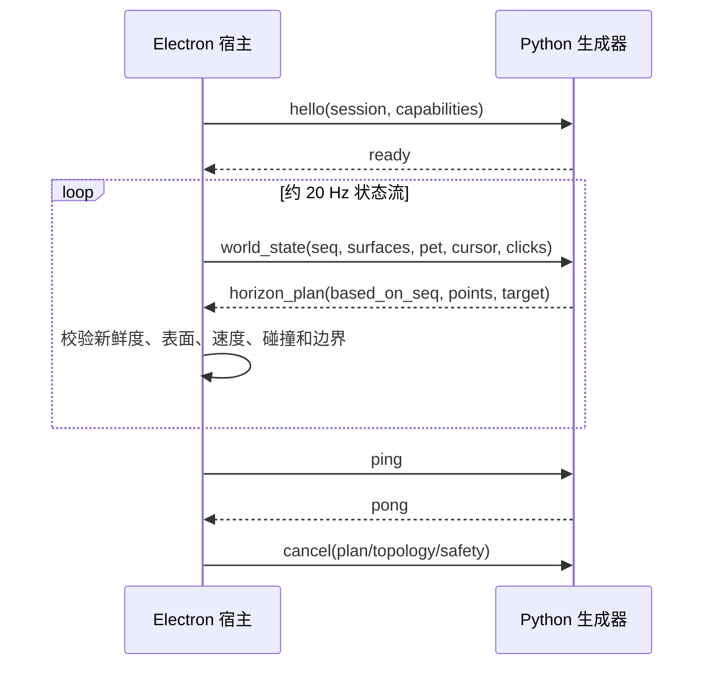

# PET 架构与模型演进路线

## 设计判断

桌宠实时生成动作是可行的，但不应让神经网络直接控制 Win32 窗口，也不宜在第一阶段逐帧扩散 48×48 RGBA 图像。桌面交互最难的部分是低延迟、连续性、窗口拓扑变化和故障安全；把动作表示为低维轨迹与姿态参数，可以先解决这些问题，同时保留扩散模型带来的随机性与风格差异。

系统因此分成三个权责清楚的层次：

1. 宿主感知并匿名化窗口几何，只提供显示器、水平表面、鼠标和点击事件；
2. 生成器提出短时动作意图，输出脚底轨迹与姿态参数；
3. 宿主安全层验证、限速、碰撞、落地、隐藏并最终移动窗口。

任何模型异常都只能导致 plan 被拒绝或桌宠进入安全待机，不能影响其他窗口。

## 进程边界

Electron 和 Python 通过私有 stdin/stdout 传输版本化 NDJSON，不开放本地端口。协议权威文件是 `packages/protocol/schemas/v1/pet-motion.schema.json`。



跨进程坐标统一为 Windows 物理像素；Electron 的 DIP 转换只发生在宿主边界。运动点的 `dx/dy` 相对于对应 `world_state` 的脚底锚点，避免宿主和模型竞争写绝对位置。

## 运行时状态流

- 窗口跟踪器枚举可见窗口，按 Z 序裁剪被遮挡的顶部水平区间，并加入每个显示器工作区底边；
- 状态队列容量为 1，生成较慢时覆盖旧世界状态，但合并尚未消费的点击 id；
- 生成器每次返回约 400 ms 的滚动 horizon，宿主可以在下一状态到达时重新规划；
- 窗口移动、最小化、关闭、DPI/显示器变化会使旧目标失效并取消 plan；
- 当前活动窗口真正覆盖显示器时隐藏桌宠，任务栏、开始菜单和系统安全表面不作为落脚点；
- 生成器退出、心跳超时或协议错误时，宿主立即停止旧 plan，并以指数退避重启新会话。
- `ready` 只有在骨骼 encoding 与 rig fingerprint 协商完成后才真正进入可规划状态；每次重新握手先清除上一会话的 renderer/controller rig，异步结果必须匹配当前 child generation 才能提交。

冲突优先级固定为：用户拖拽预留入口 > 窗口拓扑变化 > 宿主安全层 > 生成 plan > fallback。

## 动作表示

每个短轨迹点包含：

- `dx/dy`：脚底相对位移；
- `vx/vy`：期望速度；
- `facing`：朝向；
- `lean/squash/bob`：身体倾斜、压缩和起伏；
- `expression`：离散表情提示。
- 在 3D 骨骼 capability 协商成功时，还原子地包含 `root_translation`、`root_rotation` 和 N 个 `local_rotation_deltas`；N 与顺序来自当前角色 manifest。

角色由 `pet-character-rig-manifest-v1` 描述：完整层级、rest TRS、精确 driven joint order、坐标系、源 skin/IBM、训练动画和 checkpoint 身份都归属于具体角色。宿主与生成器计算同一 rig fingerprint；不匹配时禁止 3D 姿态进入执行链。渲染器已经能对任意拓扑做四元数 FK 和正交侧视投影；单张 sprite 的正常路径通过自动 2D joint warp 消费姿态，identity 逐像素保持、非 identity 会改变最终 raster。该自动绑定没有角色真实 skin weight、分层或自遮挡信息，不能冒充真正的 mesh skinning；高质量角色仍需专属 2D 权重/分层资产或完整 glTF 蒙皮。

生成器不输出完整图像帧，因此 60 FPS 渲染不依赖 GPU 推理频率，也不会出现逐像素生成中的闪烁和身份漂移。未来无论使用 3D mesh skinning、Live2D 类 2D 变形器还是分层 RGBA rig，都必须消费相同的 FK 姿态，而不能改变宿主的安全与窗口位置权责。

## 当前基线

`AutoregressiveMotionBackend` 是有状态的随机运动基线：

- 行走速度由前一步速度、目标速度和小噪声自回归更新；
- 跳跃从同屏附近可见表面中选择目标，并连续生成平滑抛物线轨迹；
- 无支撑时生成受重力约束的下落；
- 点击 id 只消费一次，并优先生成压缩、回弹、后退或转身反应；
- 随机种子写入每个 plan，可重放问题会话。

它的作用是验证协议、交互和延迟预算，并提供模拟数据中的桌面行为/根轨迹教师。它本身只输出 identity 局部骨骼姿态；离线数据生成已由角色动画 teacher 注入非 identity rest-local quaternion delta，并逐样本记录 clip fingerprint、phase 和 pose source，禁止把 procedural identity 输出直接当作姿态训练集。

## 条件生成模型路线

### 数据生成

构建不操作真实窗口的二维场景模拟器，随机产生：显示器工作区、窗口矩形/Z 序、移动/最小化事件、起点、候选目标和点击。用确定性动力学与规则策略产生合法轨迹，再加入风格参数、时序扰动和人工筛选样本。

一个训练样本绑定到一个具体角色的 rig fingerprint，可表示为：

```text
过去 K 帧状态 + 候选表面集合 + 事件/目标
    -> 未来 H 帧 [dx, dy, vx, vy,
                  root_translation, root_rotation,
                  local_rotation_deltas(N×4), facial]
```

表面集合采用相对坐标和 mask，窗口标题、应用名、截图和按键不进入模型或数据集。数据目录必须带版本化 manifest，明确 condition/target 顺序、K/H/dt、`characterId`、`rigFingerprint`、`drivenJointOrder`、动画 clip fingerprint 和 teacher provenance；不同 ABI 不允许混写。

### 模型次序

1. 先训练小型 causal Transformer/MLP 行为克隆模型，确定数据表示、闭环稳定性和推理下限；
2. 再使用 1D conditional diffusion 或 flow matching 对整段 `H×D` 动作序列去噪；
3. 以 classifier-free guidance 或显式风格 embedding 控制活泼、谨慎、困倦等动作风格；
4. 使用 DDIM/DPM-Solver、consistency/rectified-flow 蒸馏或少步学生网络压到 1～4 步；
5. 只在 Python 后端加载 PyTorch，完成权重加载和 warmup 后才发送 `ready`。

模型代码可以复用，但每个具体角色独立训练与分发 checkpoint。checkpoint bundle 必须精确绑定 `characterId + rigFingerprint + drivenJointOrder + dataset schema + normalization`；不得为适配另一个角色而截断输出或补 identity joint。

像素级生成可以作为更晚的外观层研究：例如低频生成表情/部件变体，再由稳定的程序化骨架驱动；不建议让它成为桌宠位置控制闭环的一部分。

### 训练与部署门槛

- 开环：位置/速度误差、落点成功率、轨迹 jerk、碰撞违规率；
- 闭环：随机窗口变化下 30 分钟稳定性、重规划恢复率和越界次数；
- 多样性：相同条件不同种子的轨迹覆盖，同时不能牺牲落地率；
- 性能：单次 plan p95 < 100 ms，日常常驻显存尽量低于 1 GB；
- 安全：所有神经网络输出继续通过当前宿主验证器，不能以“模型置信度”跳过规则。

## 开源基底边界

`third_party/desktop/openpets` 是桌面宿主的主要设计基底，原始快照保持不改；`desktop/UPSTREAM.md` 记录具体派生边界。其余 `third_party/motion` 和 `third_party/pixel` 仓库用于研究动作扩散、世界模型、实时扩散和像素生成，不直接把其完整应用或旧依赖树并入产品。

统一环境固定为 Python 3.10.20 和 PyTorch 2.10.0+cu130。新增模型适配器应最小化依赖，并先经过 `environment/smoke_test.py`，不能整体安装上游 `requirements.txt` 覆盖现有 Torch/CUDA 组合。
